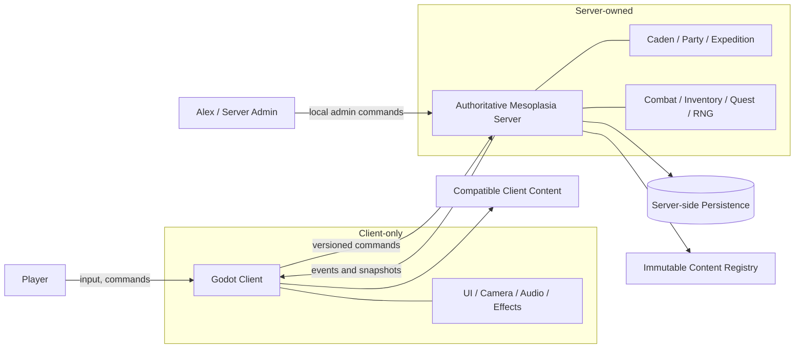
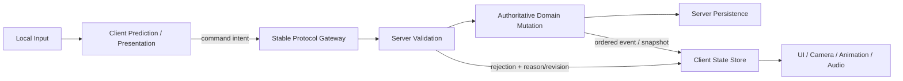
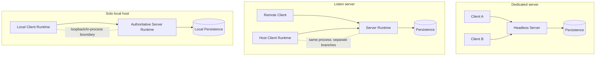

# Cooperative Multiplayer Architecture

## System context and responsibility split



The client never supplies damage, loot, progression, final position, save data, or another player's identity. The server never requires a camera, local input device, audio, or decorative rendering.

## Client/server responsibility split



The protocol gateway is the only network-facing boundary. Domain mutation and persistence remain on the server side; prediction and rendering remain disposable client projections.

## Supported topology comparison



| Mode | Server runtime | Client runtime | Transport recommendation | Ruleset |
| --- | --- | --- | --- | --- |
| Dedicated | Headless process | One per player | ENet over UDP | Same authoritative domain services |
| Listen | Host process branch | Host local branch plus remote clients | ENet; local branch may use a separate in-process `MultiplayerAPI` branch | Same |
| Solo | Local authoritative branch | One local branch | Start with in-process client/server branches; retain command serialization boundary | Same |

**Provisional recommendation:** use one executable/project and one composition model. In listen/solo modes, keep server and client under separate scene-tree branches with distinct service containers. Godot supports assigning a custom `MultiplayerAPI` to a tree branch, but this topology must be proven in the network sandbox before it becomes a production dependency. A loopback ENet fallback is acceptable if branch-local APIs make testing or lifecycle handling brittle.

## Proposed application composition

```text
ApplicationRoot
├── RuntimeModeCoordinator
├── SharedDefinitions                 # immutable registry only
├── ServerRuntime                     # dedicated/listen/solo host
│   ├── NetworkServerEndpoint
│   ├── SessionCoordinator
│   ├── AuthoritativeSimulation
│   ├── InstanceRegistry
│   ├── PersistenceCoordinator
│   └── AdminConsole
└── ClientRuntime                     # listen/solo/remote player
    ├── NetworkClientEndpoint
    ├── ClientStateStore
    ├── WorldPresentationRoot
    ├── LocalAvatarInput
    └── LocalUIRoot
```

`ApplicationRoot` is a composition root: it constructs dependencies, selects runtime mode, and owns shutdown order. Services receive explicit references; gameplay code does not locate them through arbitrary `/root` paths.

## Placement of major responsibilities

| Responsibility | Owner/lifecycle |
| --- | --- |
| Network transport | Endpoint under ServerRuntime or ClientRuntime; created at host/join, closed after save/shutdown. |
| Connection lifecycle | Server `SessionCoordinator`; client endpoint mirrors connection status. |
| Server simulation | Headless-capable services under `AuthoritativeSimulation`; advanced by server tick/commands. |
| Player spawning | Server creates `AvatarRuntimeState`; client presentation creates/removes avatar views from events/snapshots. |
| Caden instance | Server hub state plus active-zone registry; each client loads only presentation it needs. |
| Expedition/combat instances | Server `InstanceRegistry`, keyed by stable IDs; client view is disposable. |
| UI/camera/audio/effects | `LocalUIRoot` and `WorldPresentationRoot`; absent on dedicated servers. |
| Persistence | Server-only coordinator and repository interfaces. |
| Admin controls | Dedicated/listen server-only console boundary; never exposed as client gameplay RPCs. |

## Autoload evaluation

No autoload is recommended for the first migration. Scene-root composition is sufficient for deterministic startup, explicit test injection, listen/solo coexistence, and clean teardown. An autoload may later be proposed only for an engine-lifetime bootstrap that must survive scene replacement; any proposal must document responsibility, client/server presence, lifecycle, tests, and why `ApplicationRoot` cannot own it. Convenience access is not a reason.

## Domain boundaries

| Domain | Responsibility and owned data | Inputs | Outputs | Persistence | Network scope |
| --- | --- | --- | --- | --- | --- |
| Identity/character | peer-to-account mapping, profiles, character persistent state, avatar runtime state | authentication proof, character selection, loaded records | identity binding, avatar state/events | profile/character | private account snapshot; visible avatar projection |
| Network session | host/join, handshake, timeout, auth, reconnect, kick/ban, shutdown notice | transport signals, credentials, version fields | session state/events | bans/allowlist/config as approved | connection-only |
| Shared hub | Caden zone membership, avatars, NPC/world state, return points, unlocks | movement/interact/transition commands | hub snapshots/events | world unlocks and safe positions | relevant zone/players |
| Party | membership, leader, invites, ready state, policy/votes | party commands | party events/snapshot | checkpoint only when policy requires | party members |
| Expedition | eligibility, seed, transfer, checkpoints, outcome, settlement | launch/retreat/admin commands, dungeon/combat outcomes | instance events/snapshots | active checkpoint and outcome | expedition members/admin |
| Dungeon | room graph and mutable instance state | movement/interact/encounter outcomes | room/door/encounter events | expedition checkpoint | members in instance |
| Combat | combatants, turns, actions, RNG, AI, outcome | validated action intent, definitions | ordered combat events/snapshots | bounded checkpoint | participants/spectators if approved |
| Inventory/equipment | ownership, stacks, instances, slots, idempotent transactions | transaction commands/reward intents | transaction result/events | transactional player records | owning player; selected public equipment |
| Quest/narrative | scoped progress, flags, dialogue decisions, reward triggers | validated choices and domain events | progress/decision/reward intents | by scope | owner/party/world audience |
| Persistence | load/save, transactions, dirty sets, backups, migration | authoritative records | commit/failure/recovery result | server storage | never client writable |
| Content registry | load immutable definitions; resolve/validate IDs | packaged Resources/manifest | read-only definitions/errors/hash | packaged content, not save state | compatible manifest on both ends |
| Presentation | visuals, UI, camera, audio, interpolation | snapshots/events/local settings | commands and rendered feedback | local settings only | client-only |

Each domain exposes commands/queries/events or narrow interfaces. Scene nodes adapt these interfaces; they do not become the sole owners of domain state.

## State ownership matrix

| Scope/state | Authority | Replication | Save scope | Reset | Reconnect |
| --- | --- | --- | --- | --- | --- |
| Camera, UI selection, cursor, hover | Local client | None | optional client settings only | view/menu change | rebuilt locally |
| Graphics/audio/key bindings | Local client | None | local config outside server saves | explicit user reset | retained locally |
| Peer ID, ping, handshake, auth phase, ack sequence | Server session; client mirrors own | owning connection | no, except security audit | disconnect | new peer ID; bind to same account after auth |
| Player profile/progression | Server | owner snapshot; selected public projection | player record | administrative/migration only | full owner snapshot |
| Inventory/equipment/personal quests | Server | owner; public equipment subset if needed | player/character transaction | validated domain action | full snapshot plus transaction watermark |
| Last safe hub location | Server | owner and relevant zone | character | authoritative transfer/checkpoint | spawn at saved safe point if live position unsafe |
| Hub unlocks/world flags/NPC state | Server | relevant players; world events | world record | explicit world rule/admin | hub snapshot at current version |
| Hub avatar positions | Server | nearby/relevant clients | safe position at checkpoints, not every tick | zone transfer/disconnect policy | authoritative spawn/snapshot |
| Party members/leader/readiness/selection/vote | Server | party members | optional party checkpoint; no permanent social history required | leave/disband/launch policy | party snapshot; readiness normally false after expiry |
| Expedition seed/rooms/doors/encounters/checkpoint/loot watermark | Server | expedition members | active expedition record | close/abandon after settlement | full expedition snapshot and membership restore |
| Combatants/turn/health/resources/status/RNG/log | Server | combat participants | combat checkpoint when supported | combat close | full snapshot plus bounded recent events |
| Client prediction/interpolation buffers | Local client | None | no | correction/zone load | rebuilt from snapshot |

## Failure rules

- A failed client view load does not mutate authoritative state; the server waits at a transfer barrier, times out, and applies the expedition policy.
- A malformed or stale command is rejected without partial mutation and with a stable reason code.
- A persistent transaction either commits its complete write set or commits nothing.
- Presentation errors may drop an animation but must not roll back accepted server state.
- Server shutdown stops admission, quiesces new persistent commands, checkpoints, flushes, closes transport, then exits.

## Dependencies and test seams

Pure domain services depend on interfaces for clocks, IDs, RNG, content lookup, and repositories. Production adapters use Godot time/Resources/transport/files; tests inject deterministic substitutes. Scene integration tests verify adapters, while unit tests do not instantiate rendered scenes.
