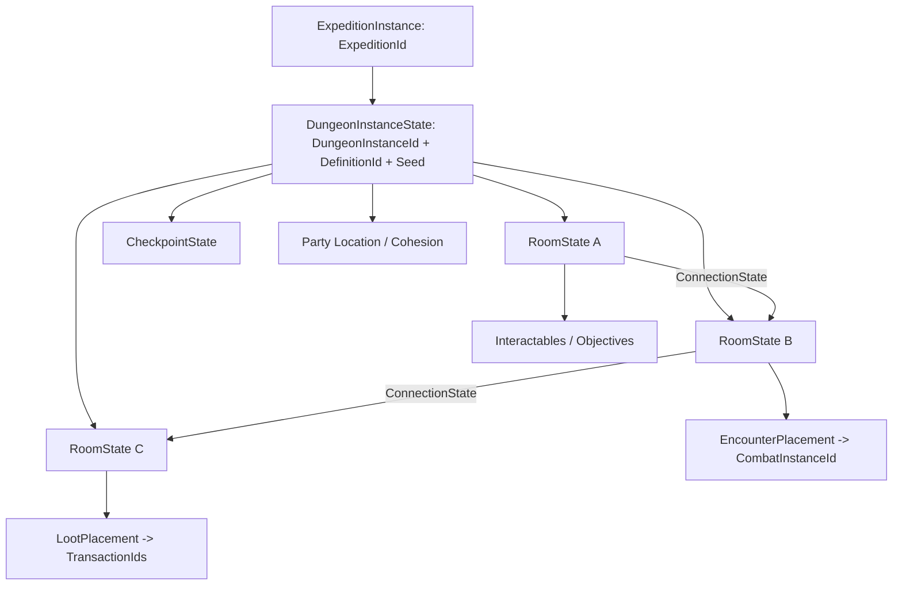

# Dungeon Instance Architecture

## Definition/runtime separation

| Immutable definition | Mutable authoritative state |
| --- | --- |
| `DungeonDefinition` | `DungeonInstanceState` |
| `DungeonRoomDefinition` | `DungeonRoomState` |
| `DungeonConnectionDefinition` | door/open/lock state keyed by connection ID |
| `EncounterPlacementDefinition` | encounter pending/active/completed plus combat ID |
| `LootPlacementDefinition` | loot resolution/transaction watermark |
| checkpoint definition/marker | `DungeonCheckpointState` |

First implementation uses handcrafted dungeon definitions and authored room scenes. Seeded variation is optional later and cannot be required for content validity.

## Instance structure

Every instance has unique `ExpeditionId` and `DungeonInstanceId`, even under the one-active-expedition MVP.

## Owned state

`DungeonInstanceState` owns definition/content version, seed, lifecycle revision, room graph reference, current party room/context, visited rooms, connection/door states, encounter states, interactable/objective states, loot watermarks, checkpoint, and cleanup status. It stores stable IDs and compact state, not scene nodes or Resource objects.

## Room presentation and server simulation

- Server domain loads definitions and collision/navigation abstractions required for validation; it must not require decorative sprites, camera, UI, or audio.
- Each client loads the authored room scene as presentation and binds it to a room snapshot.
- Server commands reference dungeon/room/interactable/encounter IDs.
- Scene nodes expose those IDs through adapters. A renamed node path cannot change persisted identity.
- Room unload on one client does not destroy instance state.

## Provisional party cohesion rule

For MVP, all active party members occupy the same dungeon room or one shared encounter context. A room transition begins only when the party policy is satisfied (provisional: leader initiates and all connected members are within the exit readiness area). This avoids concurrently simulating many client-specific room scenes, split encounters, and ambiguous checkpoints.

This is an open product decision. The data model retains `CharacterId -> RoomId` so limited splits can be introduced later, but the initial rule validator rejects unsupported separation.

## Encounter transition

1. Server detects or validates encounter trigger in active room.
2. Resolve eligible party and enemy participants from authoritative state.
3. Lock relevant exploration interactions/movement and mark encounter `ALLOCATING`.
4. Create `CombatInstanceId`, combatants, deterministic seed/state, and initial turn queue.
5. Save a transition checkpoint sufficient to avoid duplicate encounter/rewards.
6. Clients load the selected combat presentation and acknowledge readiness.
7. Send reliable full combat snapshot; begin turns.
8. On outcome, apply defeated-enemy/room/objective changes and create reward intents.
9. Save checkpoint/transactions, release exploration lock, and send room snapshot.

**Provisional presentation recommendation:** a dedicated combat scene for MVP. It cleanly isolates real-time exploration presentation from turn-based UI and makes reconnect/load tests easier. The simulation API also supports a future overlay or in-place presentation.

## Checkpoint contents

- expedition/dungeon IDs, definition/content version, seed and instance revision;
- party membership/controller/disconnect state references;
- current room and validated return positions;
- visited rooms, doors/connections, encounters, objectives, interactables;
- loot/reward transaction watermarks;
- active combat reference and checkpoint if combat recovery is supported;
- timestamp, save schema, checksum/validation metadata.

Checkpoints occur at launch commit, authored checkpoint, significant room/encounter completion, combat boundary, retreat/outcome, and graceful shutdown. Do not checkpoint per movement tick.

## Cleanup

An instance closes only after outcome and rewards are committed, all characters have a safe Caden location, active combat is closed/checkpointed, clients are unsubscribed, and persistence records success. Abandoned instances can be inspected/closed through audited admin commands. Startup recovery either restores a compatible checkpoint or returns affected characters safely to Caden with an explicit recovery record; it never silently grants or discards rewards.

## Tests

Validate broken room links, duplicate IDs, unreachable required rooms, missing encounter/loot references, room transitions, cohesion rejection, simultaneous trigger deduplication, reconnect, combat round-trip, checkpoint/recovery, outcome idempotency, and cleanup with a disconnected member.
