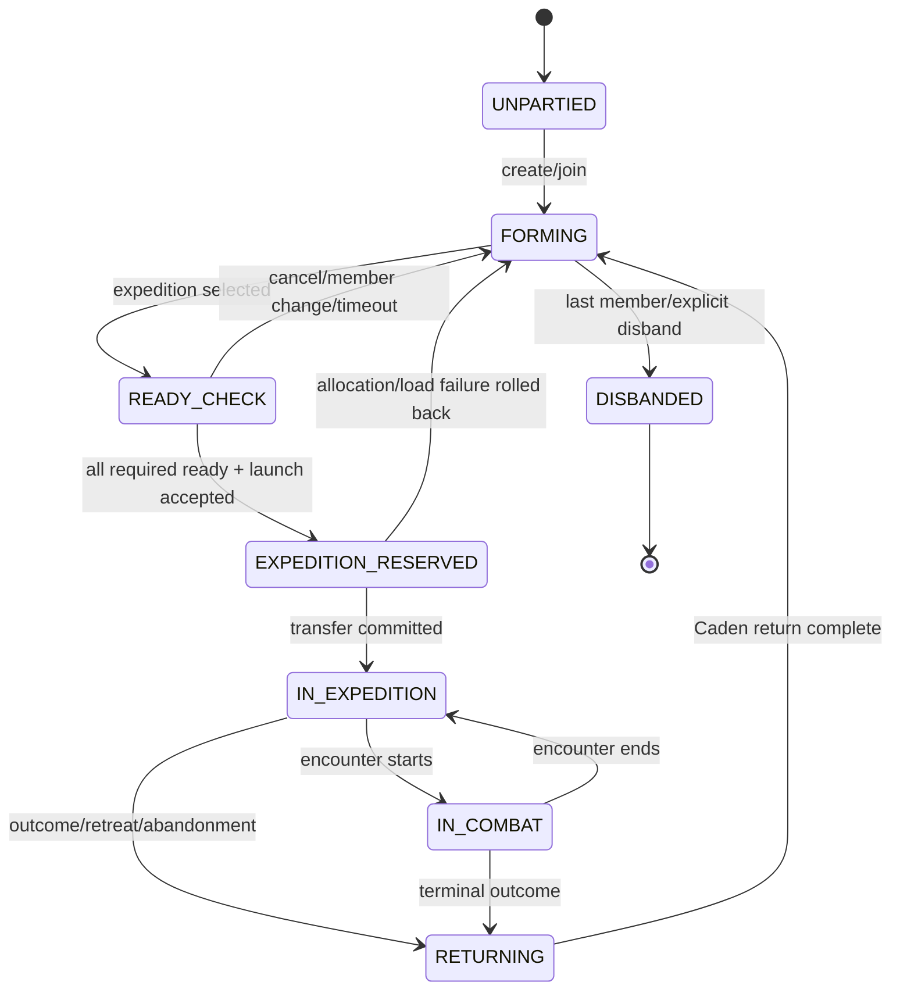
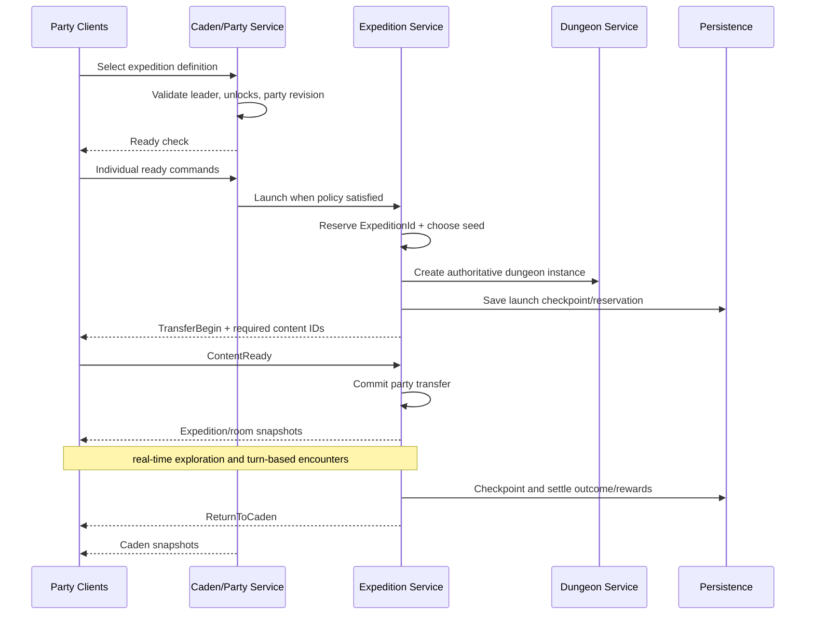
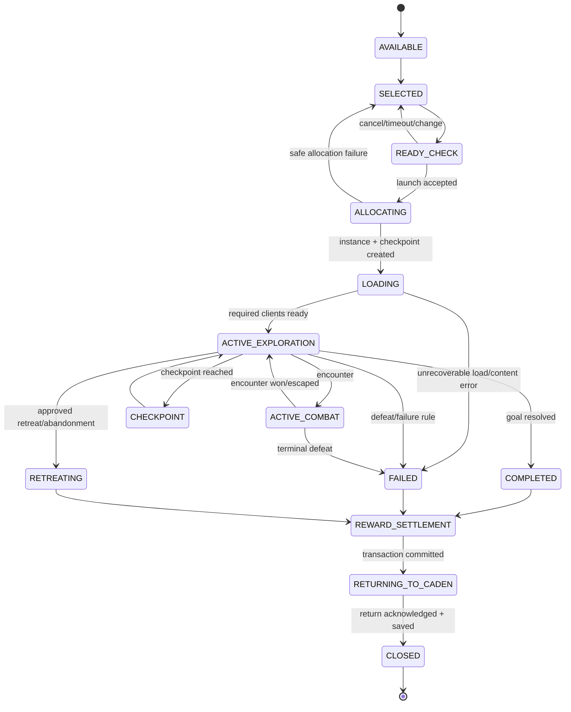

# Party and Expedition Model

## Party aggregate

```text
PartyState
  party_id
  revision
  lifecycle_state
  member_character_ids
  leader_character_id
  ready_by_character_id
  selected_expedition_definition_id?
  current_expedition_id?
  active_decision?
  invitations
  disconnected_member_deadlines
```

Maximum size is a server policy value. The provisional target is 1-4, but domain validation compares against `max_party_size`, never literal four.

## Party state machine



`UNPARTIED` is a character condition, not a stored Party aggregate. `DISBANDED` is terminal and retained only as audit/tombstone as required.

## Party rules

- Invites contain stable invite ID, party revision, inviter/recipient character IDs, created/expiry times, and status.
- Joining revalidates capacity, eligibility, recipient identity, and current revisions.
- Only a member may change their own ready state; any membership or expedition-selection change clears readiness.
- Leader departure transfers leadership by deterministic policy (provisional: longest-tenured connected member, then stable ID tie-break) or disbands if empty.
- A disconnected member retains membership during grace but cannot silently remain ready after the ready-check deadline.
- Party persistence is limited: save active expedition linkage/checkpoint and any durable party-scoped narrative state; normal social parties need not survive a clean server restart for MVP unless Alex approves it.

## Party decision policies

| Policy | Appropriate use | Tradeoff |
| --- | --- | --- |
| Leader decides | expedition selection and routine navigation in MVP | fast; concentrates control |
| Majority | shared narrative/retreat where speed matters | tie/abstention policy required |
| Unanimous | high-impact irreversible choice | one player can block; disconnect policy required |
| Individual | personal dialogue/loot | not suitable for shared state |
| Server rule | timeout/default/safety decisions | deterministic but less expressive |

**Provisional MVP:** leader selects an expedition; every present member individually readies; launch requires all eligible present members ready. Retreat uses majority with leader breaking a tie. Narrative decisions select policy per definition. All remain open for approval.

## Caden-to-expedition flow



## Expedition aggregate and state machine



`AVAILABLE` and `SELECTED` may be party-selection states rather than persisted expedition records; the stable `ExpeditionId` is created no later than `ALLOCATING` and is used thereafter.

## Launch failure handling

| Failure | Safe outcome |
| --- | --- |
| Definition/unlock/capacity invalid | Reject before reservation; remain in Caden. |
| Instance creation fails | Delete incomplete reservation or mark failed; party returns to forming, readiness cleared. |
| Client content hash mismatches | Reject client at handshake or abort before transfer with readable reason. |
| One client fails to load | Wait configurable timeout; retry; then cancel launch for MVP. Later policy may allow disconnected grace. |
| Server save/checkpoint fails | Do not commit transfer; surface maintenance error and retain Caden state. |
| Disconnect after commit | Expedition continues under disconnect policy; reconnect receives instance snapshot. |

## Completion and settlement

1. Resolve outcome authoritatively and stop new expedition actions.
2. Calculate reward entitlements as deterministic transaction intents.
3. Atomically write grants, quest updates, loot watermarks, and expedition outcome.
4. Retry idempotently on recoverable failure; never grant twice.
5. Move each character to an approved Caden return point and save safe state.
6. Notify clients with result plus fresh snapshots.
7. Archive the minimal outcome record and destroy live instance only after references are closed.

## MVP instance policy

Use one active expedition per server for MVP, enforced by policy, while every API and record uses `ExpeditionId`. Do not use a singleton `current_dungeon` in domain logic. Multiple instances later become a registry/capacity change, not a data-model rewrite.
