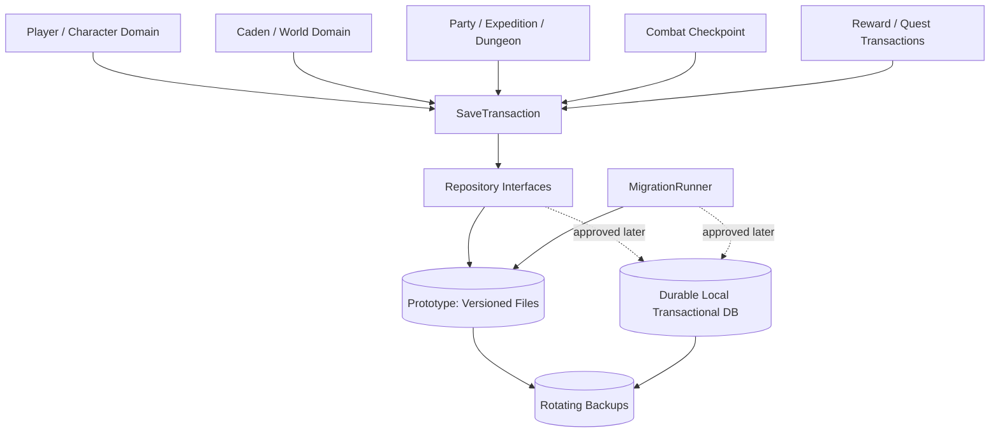

# Persistence and Migration

## Boundary and interfaces

Persistence runs only on the authoritative server. Domain services own rules; repositories map validated records to storage.

```text
PlayerRepository
WorldRepository
PartyRepository
ExpeditionRepository
CombatCheckpointRepository
SaveTransaction
MigrationRunner
BackupService
```

Repositories expose typed load/store/query operations and expected revisions. `SaveTransaction` commits a coherent set of player/world/expedition/reward records or none. The client cannot choose paths, filenames, schemas, or save payloads.

## Persistence ownership



## Backend progression

### Prototype backend

Use versioned deterministic server-side files (JSON is acceptable) behind repositories. Split records by aggregate/category so movement does not rewrite the world. Write canonical key/order formatting for review/tests.

Atomic file commit:

1. serialize and validate the complete record in memory;
2. write a uniquely named temporary file in the destination directory;
3. flush/close and reread/validate checksum/schema;
4. preserve/rotate the previous committed file;
5. atomically replace/rename temp to live where the platform guarantees it;
6. record transaction result/manifest last;
7. clean stale temps only after validating their paths and recovery status.

Cross-file transactions need a small transaction manifest/journal: stage all files, record intent, promote, then record commit. Startup completes or rolls back an interrupted transaction idempotently.

### Durable backend

After load/recovery requirements justify it and dependency approval is granted, implement the same repository interfaces with a local transactional database such as SQLite. Benefits are atomic multi-record transactions, indexes, concurrency discipline, and migrations; costs are dependency/export/backup/operational complexity. Do not add it preemptively and do not expose SQL to domain services.

## Save record categories

| Record | Key/scope | Contents |
| --- | --- | --- |
| Server configuration | server instance | non-secret versioned public config; secrets stored separately |
| World | server world ID | Caden/world flags, unlocks, persistent NPC state, revisions |
| Player profile | AccountId | display/admin metadata, character ownership |
| Character | CharacterId | progression, safe hub position, unlocks, state revision |
| Inventory/equipment | CharacterId | stacks, item instances, slots, transaction watermarks |
| Quest/narrative | scope owner + definition ID | progress, flags, decisions, reward watermarks |
| Party | PartyId when appropriate | active expedition linkage and durable decision state only |
| Expedition checkpoint | ExpeditionId | dungeon instance, party, rooms/doors/encounters/loot/checkpoint |
| Combat checkpoint | CombatInstanceId | combat state/RNG/turn/event watermark when recovery is supported |
| Outcome/archive | ExpeditionId/transaction IDs | minimal completed result and idempotency evidence |

## Save timing

| Trigger | Durability rule |
| --- | --- |
| Join/load | validate existing records; do not rewrite solely for reading |
| Inventory/equipment/currency transaction | commit before success acknowledgement |
| Persistent quest/dialogue update | transaction with linked reward/flag |
| Combat | checkpoint at combat start, round/significant action according to measured cost, and outcome; never every animation |
| Dungeon checkpoint/room or encounter completion | commit instance state and loot watermark |
| Expedition completion/retreat/defeat | atomic outcome, rewards, quest updates, safe return |
| Return to Caden | save character safe position and close instance links |
| Periodic dirty flush | provisional 30 seconds for non-transactional dirty world/player state |
| Graceful shutdown/admin save | quiesce commands, checkpoint, flush all dirty records, report failures |

Movement positions may update a dirty safe-location record at low frequency/checkpoints; never rewrite the whole world per movement packet.

## Backup and recovery

- Rotate a configurable small set of timestamped/checksummed backups (provisional: 5 daily plus 3 most recent transaction checkpoints).
- Validate live records, manifest, schema, IDs, and checksums at startup.
- On corruption, stop mutation, preserve corrupt files, attempt last-known-good backup, and log exact records/revisions restored.
- Never silently reset a player/world. If recovery is unsafe, start in maintenance/read-only mode and require admin choice.
- Provide an audited `backup` command that creates a consistent snapshot after quiescing or using backend snapshot semantics.

## Three independent versions

| Version | Controls | Compatibility action |
| --- | --- | --- |
| `PROTOCOL_VERSION` | command/event/snapshot wire semantics | reject incompatible client with readable reason |
| `CONTENT_VERSION` | authority-relevant definitions/scenes/manifest | require compatible manifest before world entry |
| `SAVE_SCHEMA_VERSION` | persisted record shape/meaning | server runs explicit migrations before accepting players |

Never infer one version from another.

## Migration strategy

1. Detect save schema and content references without mutation.
2. Refuse unsupported downgrade or unknown future schema.
3. Create a complete pre-migration backup.
4. Plan ordered, named migrations from current to target version.
5. Apply to a staged copy/transaction while preserving unknown fields in an extension/unknown-data area or failing explicitly.
6. Validate IDs, references, invariants, checksums, and record counts.
7. Atomically promote and append migration history (from/to, tool/build, timestamp, result, backup ID).
8. On failure, keep original/backup untouched, log exact migration/record/error, and refuse normal startup.

No migration silently drops unknown fields, unknown content IDs, inventory entries, rewards, or quest state. Removal requires an approved mapping/archive policy.

## Failure behavior

- Persistent transaction failure prevents success events and preserves retry/idempotency state.
- Repeated failure places affected mutation paths in maintenance mode rather than accepting risky commands.
- Checkpoint failure during expedition prevents crossing a critical transfer/settlement boundary when rollback would duplicate or lose value.
- Crash recovery uses transaction manifests/watermarks to determine committed versus staged state.

## Tests

Test atomic replace, interrupted stage/promote/commit, corrupted/missing files, invalid checksums, backup rotation/restore, migration success/failure/downgrade, unknown-field preservation, duplicate reward recovery, dirty flush, active expedition/combat checkpoint, graceful shutdown, and backend contract parity.
