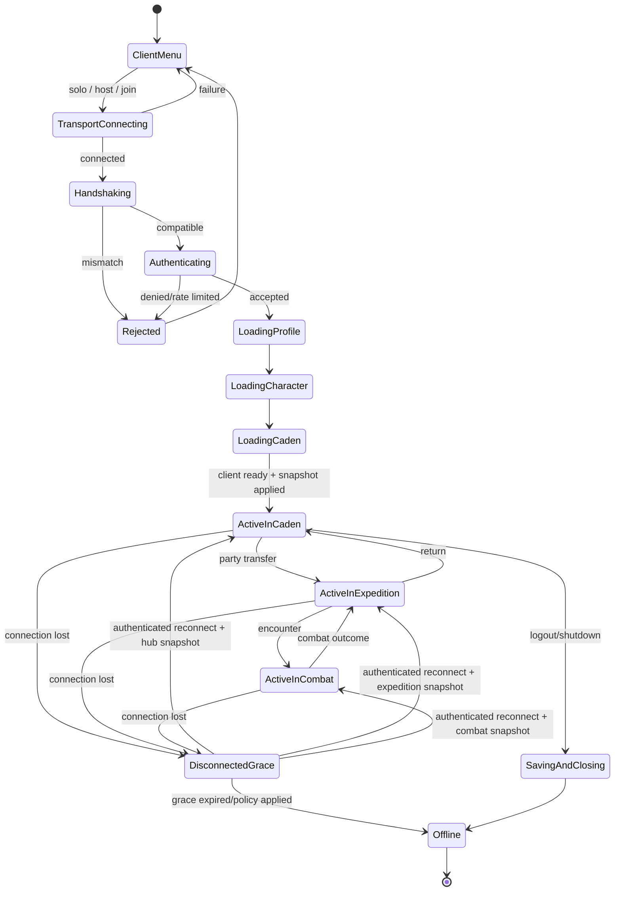

# Player and Session Lifecycle

## Identity model

| Record | Lifetime | Authority | Notes |
| --- | --- | --- | --- |
| `ConnectionPeerId` | One transport connection | ENet/MultiplayerAPI; mapped by server | Transient; never saved or used as ownership after disconnect. |
| `SessionId` | Authenticated connection/reconnect window | Server | Correlates logs and command sequences. |
| `PlayerAccountId` | Persistent server record | Server | Server-issued opaque ID; display name is metadata. |
| `CharacterId` | Persistent playable character | Server | Owned/authorized by an account. |
| `PlayerProfile` | Persistent account preferences/metadata | Server | Sanitized display fields and administrative state. |
| `CharacterDefinition` | Immutable archetype/cosmetic references | Content registry | Does not contain mutable progression. |
| `CharacterPersistentState` | Across sessions | Server persistence | progression, inventory, equipment, quests, unlocks, safe hub location. |
| `AvatarRuntimeState` | Live hub/expedition session | Server simulation | position, zone/room, locks, presence, combat link. |

Mapping is `peer_id -> session_id -> player_account_id -> selected_character_id -> avatar_runtime_id`. Only the server may create or change this mapping.

## Connection lifecycle



## Startup sequence

1. Client selects solo, host, or join.
2. Runtime mode creates a server branch if hosting and a client branch if playing.
3. Network endpoint connects (local or remote).
4. Protocol/build/content handshake completes.
5. Password/invite/allowlist proof authenticates; server binds an account.
6. Server loads and validates `PlayerProfile`.
7. Server loads the selected/only permitted `CharacterPersistentState`.
8. Server creates or reclaims an `AvatarRuntimeState` in Caden at a safe location.
9. Client loads the Caden presentation and receives private/player plus hub-zone snapshots.
10. Local input/UI bind to that `CharacterId`; server retains simulation authority.

## Disconnect behavior

| Point of disconnect | Immediate server behavior | After grace expires | Reconnect payload |
| --- | --- | --- | --- |
| Caden | freeze movement, mark presence disconnected, keep safe avatar or despawn presentation by policy | save safe position; remove runtime avatar; party policy handles member | player-private, party if any, hub-zone snapshots |
| Expedition exploration | zero input, keep character at safe/current state, notify party | configurable auto-follow/freeze; do not block room forever; retreat/remove only at safe transition | expedition, room, character, party snapshots |
| Combat | retain combatant; pause only if policy allows short grace; timer policy continues | provisional auto-defend; AI control is a later option | full combat snapshot plus bounded recent events |
| Reward settlement | continue idempotent server transaction without client | finish and save or retain recovery record | transaction result/watermark and updated player snapshot |
| Zone/scene load | keep authoritative avatar at source or reserved transfer state | cancel transfer and return to last safe state | authoritative location snapshot; never client-supplied position |
| Save operation | transaction completes or rolls back independent of socket | record failure/retry; prevent unsafe duplicate mutation | last committed revision and pending safe status |

## Reconnect flow

```mermaid
sequenceDiagram
    participant C as Reconnecting Client
    participant N as Session Coordinator
    participant I as Identity Service
    participant W as World/Instance Registry
    participant P as Persistence
    C->>N: Connect + compatible ClientHello
    N->>C: Challenge / capabilities
    C->>N: Authenticate + reconnect proof
    N->>I: Resolve account; reject conflicting controller
    I->>W: Locate active character/session
    alt live runtime within grace
        W-->>N: Hub/expedition/combat location and revisions
    else no live runtime
        N->>P: Load last committed character + safe hub location
        P-->>N: Persistent state
    end
    N->>N: Bind new peer ID to same account/character
    N-->>C: Reliable scoped snapshots + sequence watermarks
    C->>N: SnapshotApplied / ContentReady
    N-->>C: Resume input permissions
```

## Conflict and timeout policy

- A second connection for an already controlled character is rejected by default; a deliberate host-approved takeover may revoke the old session.
- Grace and takeover rules are server configuration, not client choice.
- Party membership may survive a short disconnect; readiness resets after grace or ready-check deadline.
- Reconnect tokens, if used, are short-lived secret proofs stored hashed where practical and never logged raw. Password authentication still applies according to server policy.
- A player can always be returned to Caden by a server-admin recovery command; this is audited and uses a safe registered spawn.

## Tests

Use deterministic tests for every lifecycle transition, duplicate login, stale reconnect proof, peer-ID replacement, disconnect at each table row, snapshot order, timeout, transaction continuation, and graceful shutdown. Assertions use account/character/session IDs, never display names.
