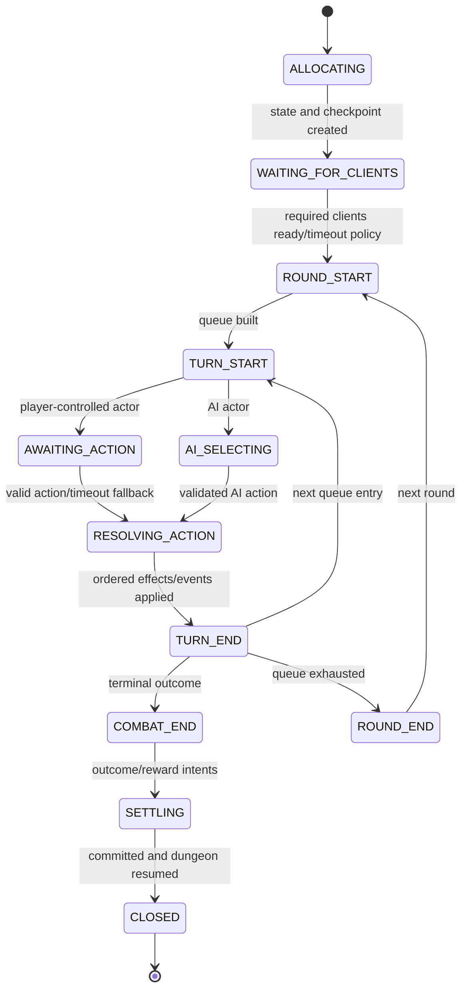

# Turn-Based Combat Architecture

## Boundary

Combat is a server-authoritative, headless-testable domain. UI, animation, camera, audio, effects, and scene transitions observe its events/snapshots and submit action intent. They never own health, turn order, costs, RNG, damage, status outcomes, victory, or rewards.

## Core records

```text
CombatInstanceId      CombatantId
CombatState           CombatantState
TurnState             TurnOrderEntry
CombatActionIntent    ValidatedCombatAction
CombatEvent           CombatSnapshot
CombatOutcome         CombatRngState
```

`CombatantState` provisionally supports team, health, resource pools, stats, ability IDs/loadout, status instances, cooldowns, initiative, alive/defeated state, controller (`CharacterId` or server AI), and an abstract combat position. Content definitions hold formulas/parameters; mutable values live in state.

## Combat state machine



## Action pipeline

```mermaid
flowchart LR
    I[Client Action Intent] --> S[Identify sender/session]
    S --> C[Confirm controlled active combatant]
    C --> T[Validate combat + turn revision]
    T --> A[Resolve ability/item definition]
    A --> K[Validate cost/cooldown]
    K --> G[Validate target and spatial rule]
    G --> L[Lock action nonce]
    L --> R[Server RNG + effect resolution]
    R --> E[Apply state and emit ordered events]
    E --> O{Terminal outcome?}
    O -- no --> N[Advance turn/round]
    O -- yes --> X[Outcome + settlement intent]
    N --> P[Snapshot/delta]
    X --> P
```



Clients send ability/item/target/position IDs and an expected combat revision. They never send hit success, damage, healing, AI decisions, loot rolls, or final costs.

## Action and effect definitions

An `AbilityDefinition` describes stable ID, tags, costs, cooldown, targeting rule ID, spatial rule ID, and ordered effect definitions. Supported future action categories include basic attack, defend, ability, item, reposition, combat-object interaction, and end turn. Supported effect families include damage, healing, resource delta, status apply/remove, stat modifier, forced movement, summon, and conditional effects.

Effects operate through a validated effect context and emit explicit events. Do not embed balance formulas in combat UI or animation names. Do not implement unused effect families preemptively.

## Targeting and spatial model

Target validation is a domain rule independent of UI selection. It may support self, ally, enemy, all allies/enemies, selected position, area, or random valid target as definitions require.

| Model | Advantages | Disadvantages | Migration impact |
| --- | --- | --- | --- |
| Non-grid target-based | lowest complexity; easy networking/reconnect; fits authored ability targeting | limited positional tactics | abstract `CombatPosition` can be slot/null initially |
| Formation/row | moderate tactics and clear UI; deterministic range | row rules become core balance | position becomes formation slot |
| Tactical tile grid | rich movement/area tactics | largest content, pathing, UI, AI, networking, and test cost | position becomes tile coordinate; many abilities depend on grid |

**Provisional recommendation:** non-grid target-based combat for MVP, with position represented behind a `CombatSpatialRules` interface. This is not accepted canon; ADR-012 remains open.

## Turn order and round policy

Use an authoritative initiative queue as the provisional baseline:

- calculate initial initiative from immutable rules plus server RNG where defined;
- store explicit queue entries so reconnect does not recalculate;
- break ties by a documented deterministic tie value, then stable `CombatantId`;
- add summons at a rule-defined insertion point, never by array accident;
- skip defeated/ineligible entries safely;
- delayed/extra actions create explicit queue operations/events;
- expire statuses/cooldowns at declared timing hooks (`TURN_START`, `TURN_END`, `ROUND_END`);
- after every mutation, evaluate terminal conditions before advancing.

Exact initiative formula, action points, and timing model remain open.

## Timeout, AFK, and disconnect

Turn timeout is configurable; provisional default is 60 seconds. Warnings are presentation events. At timeout, the server applies a deterministic fallback—provisional `Defend`, else `EndTurn`—and logs it.

A disconnected player receives the configured reconnect grace. Combat cannot freeze indefinitely: the turn timer continues or receives one bounded pause, then uses the same fallback. Temporary AI or party-leader control are future policies requiring explicit approval because they affect agency and balance. Removing the combatant is allowed only through safe defeat/retreat rules.

## Server RNG and reproducibility

- Expedition creation assigns a server seed; combat derives a combat-specific seed/stream.
- `CombatRngState` is authoritative and checkpointed.
- Separate streams may be used for turn order, action effects, and AI to reduce accidental coupling; stream IDs and draw counts are recorded in debug/test metadata.
- Clients never roll hit, critical, enemy choice, status chance, random target, or loot.
- Pure combat calculations should be deterministic for the same definitions/state/intents/RNG service. Cross-platform real-time physics determinism is not required.

## Enemy AI

AI exists only on the server. `EnemyDecisionPolicy` reads a constrained combat view, scores candidate abilities/targets, and outputs an action intent. That intent passes through the same ability, cost, target, spatial, and resolution validators as a player action. AI cannot mutate state or bypass rules. Tests inject fixed RNG and fixtures to assert chosen intents and legal fallback.

## Event log and reconnect

Use a bounded ordered event log, not full event sourcing. Each event has combat ID, combat revision, event sequence, type, actor/targets, public payload, and optional owner-private payload. It supports animation, recap, late recovery, reconnect, diagnostics, and tests.

On reconnect: authenticate -> locate active combat -> send reliable full `CombatSnapshot` -> send relevant recent events after the snapshot watermark if needed -> client rebuilds presentation -> resume according to current timer. If the requested event sequence has aged out, send another full snapshot rather than reconstructing history.

## Outcome and dungeon return

Combat outcome contains result, surviving/defeated combatants, authoritative state deltas, defeated enemy placement IDs, reward intents, quest/domain events, and next dungeon state. The expedition/persistence coordinator commits encounter completion and reward watermarks before exploration resumes. Client presentation failure cannot reverse an accepted result.

## Test strategy

Unit-test legal/illegal actions, target categories, cost/cooldown, effect ordering, initiative/ties, summons, status timing, defeat, timeout, disconnect, deterministic RNG/AI, snapshot round-trip, event bounds, and reward-intent deduplication. Authority tests attempt another player's turn, invalid targets/IDs/costs, stale revisions, replayed action nonce, and client-supplied outcomes.
